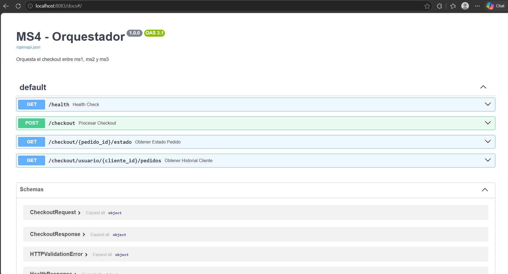
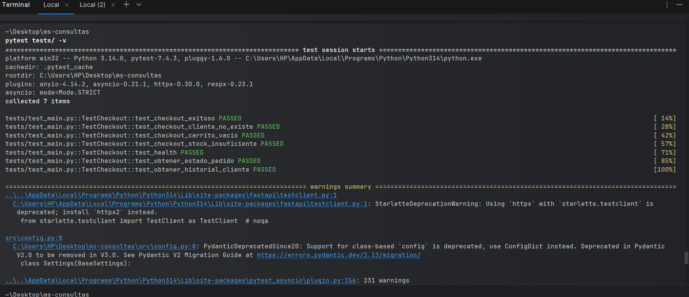
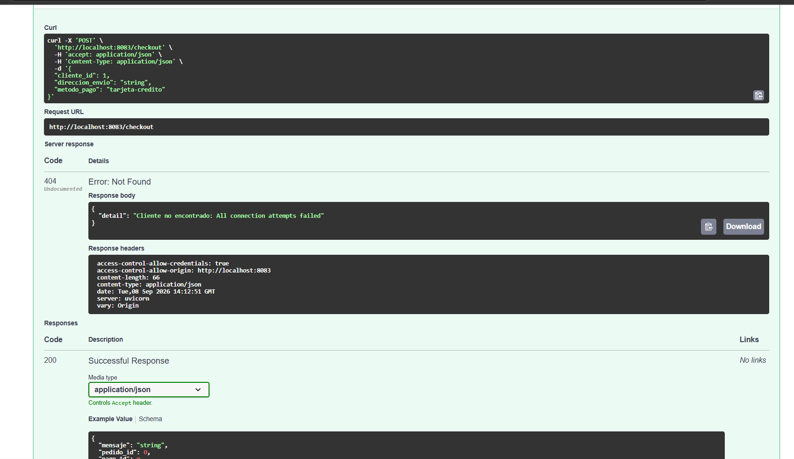

# MS4 - Orquestador

## Responsable
Elias Alonso Usaqui Cabezas

---

## Descripción
Microservicio orquestador que coordina el flujo de checkout de la plataforma. Consume los microservicios:

- **ms1** - Productos e inventario (SQL 1)
- **ms2** - Clientes, pedidos y pagos (SQL 2)
- **ms3** - Carrito de compras (NoSQL)

---

## Tecnologías
- Python 3.10+
- FastAPI
- Uvicorn
- Pytest
- Docker

---

## Endpoints

| Método | Endpoint | Descripción |
|--------|----------|-------------|
| GET | `/health` | Health check del servicio |
| POST | `/checkout` | Procesar compra completa |
| GET | `/checkout/{pedido_id}/estado` | Obtener estado de un pedido |
| GET | `/checkout/usuario/{cliente_id}/pedidos` | Obtener historial de pedidos |

---

## Documentación Swagger-UI

La API está documentada interactivamente con Swagger-UI.



---

## Pruebas Unitarias

Todas las pruebas pasaron exitosamente (7/7).



---

## Respuesta del Servidor

Ejemplo de respuesta al ejecutar el endpoint `POST /checkout` desde Swagger-UI.



---

## Ejecución Local

### 1. Clonar el repositorio

```bash
git clone https://github.com/TU_USUARIO/ms-consultas.git
cd ms-consultas
````

### 2. Crear entorno virtual e instalar dependencias
```bash
python -m venv venv
source venv/bin/activate  # En Windows: venv\Scripts\activate
pip install -r requirements.txt
````

### 3. Configurar variables de entorno
Crea un archivo .env basado en .env.example:
```bash
MS1_URL=http://localhost:8080
MS2_URL=http://localhost:8081
MS3_URL=http://localhost:8082
TIMEOUT=30
PORT=8083
````

### 4. Ejecutar el microservicio
```bash
uvicorn src.main:app --host 0.0.0.0 --port 8083 --reload
```

### 5. Acceder a Swagger-UI
- Abre tu navegador en: http://localhost:8083/docs

---
## Ejecución con Docker
### 1. Construir la imagen
```bash
docker build -t ms-consultas .
````
### 2. Ejecutar el contenedor
```bash
docker run -p 8083:8083 --env-file .env ms-consultas
````
### 3. Acceder a Swagger-UI
- Abre tu navegador en: http://localhost:8083/docs
---
## Pruebas unitarias
- Ejecuta las pruebas con:
```bash
pytest tests/ -v
````
---

## Variables de Entorno

| Variable | Descripción | Ejemplo |
|----------|-------------|---------|
| `MS1_URL` | URL del ms1 (Productos/Inventario) | `http://localhost:8080` |
| `MS2_URL` | URL del ms2 (Clientes/Pedidos/Pagos) | `http://localhost:8081` |
| `MS3_URL` | URL del ms3 (Carrito - NoSQL) | `http://localhost:8082` |
| `TIMEOUT` | Timeout para llamadas HTTP (segundos) | `30` |
| `PORT` | Puerto donde corre el MS4 | `8083` |

## Estructura del Proyecto

```
ms-consultas/
├── src/
│   ├── __init__.py
│   ├── main.py
│   ├── models.py
│   ├── services.py
│   └── config.py
├── tests/
│   ├── __init__.py
│   └── test_main.py
├── images/
│   ├── swagger1.png
│   ├── pruebasUnit.png
│   └── output2.png
├── Dockerfile
├── requirements.txt
├── requirements-dev.txt
├── .env.example
├── .dockerignore
├── conftest.py
└── README.md
```
## Repositorio

[Enlace a tu repositorio en GitHub](https://github.com/EliasUsaqui-tech/ms-consultas.git)